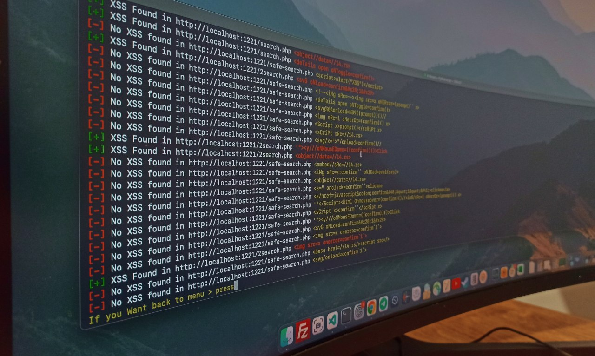

<h1 align="center">
  <br>
  <a href="https://github.com/joshkar/X-Recon"></a>
</h1>

<h4 align="center">A utility for identifying web page inputs and conducting XSS scanning.</h4>

<p align="center">

  <a href="http://python.org">
    
  </a>

  <a href="https://en.wikipedia.org/wiki/Linux">
    
  </a>

</p>

### Features:
- **Subdomain Discovery:**
  - Retrieves relevant subdomains for the target website and consolidates them into a whitelist. These subdomains can be utilized during the scraping process.

- **Site-wide Link Discovery:**
  - Collects all links throughout the website based on the provided whitelist and the specified `max_depth`.

- **Form and Input Extraction:**
  - Identifies all forms and inputs found within the extracted links, generating a JSON output. This JSON output serves as a foundation for leveraging the XSS scanning capability of the tool.

- **XSS Scanning:**
  - Once the start recon option returns a custom JSON containing the extracted entries, the X-Recon tool can initiate the XSS vulnerability testing process and furnish you with the desired results!

<br>
  <a href="https://github.com/joshkar/X-Recon"></a>
<br>
<br>

**Note:** 

>The scanning functionality is currently inactive on SPA (Single Page Application) web applications, and we have only tested it on websites developed with PHP, yielding remarkable results. In the future, we plan to incorporate these features into the tool.

<br>
<br>

  <a href="https://github.com/joshkar/X-Recon"></a>
<br>
<br>

**Note:** 

>This tool maintains an up-to-date list of file extensions that it skips during the exploration process. The default list includes common file types such as images, stylesheets, and scripts (`".css",".js",".mp4",".zip","png",".svg",".jpeg",".webp",".jpg",".gif"`). You can customize this list to better suit your needs by editing the setting.json file..


### Installation

```bash
$ git clone https://github.com/joshkar/X-Recon
$ cd X-Recon
$ python3 -m pip install -r requirements.txt
$ python3 xr.py
