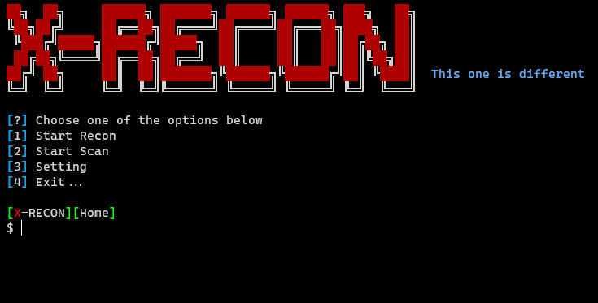

<h1 align="center">
  <br>
  <a href="https://github.com/joshkar/X-Recon"></a>

</h1>

<h4 align="center">A tool to find web page inputs and perform XSS scanning.</h4>

<p align="center">

  <a href="http://python.org">
    
  </a>

  <a href="https://en.wikipedia.org/wiki/Linux">
    
  </a>

  <a href="https://en.wikipedia.org/wiki/Microsoft_Windows">
    
  </a>

</p>

### Features:
- **Subdomain Discovery:**
  - Fetches relevant subdomains for the target website and compiles them into a whitelist. These subdomains can be utilized during the scraping process.

- **Site-wide Link Discovery:**
  - Gathers all links across the website based on the provided whitelist and the specified `max_depth`.

- **Form and Input Extraction:**
  - Identifies all forms and inputs found within the extracted links, creating a JSON output. This JSON output serves as a foundation for leveraging the XSS scanning capability of the tool.

<br>
  <div align="center">
    <a href="https://github.com/joshkar/X-Recon"></a>
  </div>
<br>

<br>
  <div align="center">
    <a href="https://github.com/joshkar/X-Recon"></a>
  </div>
<br>
<br>

**Note:** 

>This tool maintains a current list of file extensions that it skips during the exploration process. The default list includes common file types like images, stylesheets, and scripts (`".css",".js",".mp4",".zip","png",".svg",".jpeg",".webp",".jpg",".gif"`). Soon, you'll be able to customize this list to better suit your needs

<br>
<br>
  <div align="center">
    <a href="https://github.com/joshkar/X-Recon"></a>
  </div>
<br>
<br>

### Installation

```bash
$ git clone https://github.com/joshkar/X-Recon
$ cd X-Recon
$ python3 -m pip install -r requirements.txt
$ python3 xr.py
```

## Target For Test:
> You can use this address in the Get URL section
```bash
  http://testphp.vulnweb.com
```